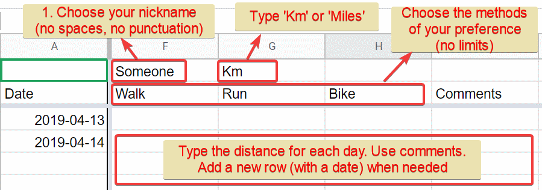

# How to join
Process is simple:
* Open the [tracking Excel](https://docs.google.com/spreadsheets/d/1oGzBmn3m_w-tq_c_vNhARID2xahvLd302_oWQIMN0hs/edit?usp=sharing){:target="_blank"}:
* Starting in the first available/free column, configure as shown in the picture
  * You will use 4 new columns.

{: height="316px" width="899px"}

Done. As simple as that.

You can now start registering your progress.
Visit the [current progress](progress.md) to see how you score amongst others.

Keep in mind this is a static site, no databases behind. Meaning, once in a while (daily for now) the Excel data will be converted as pages in this site.

Some notes:
* Use a nickname containing only letters, digits, minus '-', and underscore '_'.
  * Your nickname will be used as a filename in this site.
* Your journey log will make much more sense if you use comments. Specially some time after.

---
This page was updated in 2019-04-11


